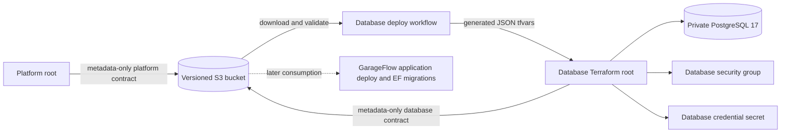

# GarageFlow database infrastructure

This repository owns the Phase 3 PostgreSQL infrastructure for GarageFlow. It creates one private RDS database per environment, the database subnet group and security group, and the application-compatible database credential secret. It does not run Entity Framework migrations or create application tables.

The repository is prepared and tested locally. No live AWS deployment, state transfer, GitHub repository setup, or branch protection is claimed here.

## Architecture and ownership



The platform contract supplies the VPC ID, two dedicated database subnet IDs, and the EKS cluster security group ID. The database root never reads the platform Terraform state and has no source reference to another checkout. PostgreSQL ingress allows TCP 5432 only from that cluster security group.

State is isolated by environment:

- `phase3/homologation/database.tfstate`
- `phase3/production/database.tfstate`

The same versioned, encrypted `TF_STATE_BUCKET` stores public metadata manifests under `contracts/v1/`. State content and secret values are never copied into those manifests.

## Database configuration

| Setting | Value |
| --- | --- |
| Region | `us-east-1` |
| Engine | PostgreSQL 17 |
| Instance | `db.t3.micro` |
| Storage | 20 GiB encrypted GP2 |
| Availability | Explicit Single-AZ Academy sizing |
| Public access | Disabled |
| Backups | Seven days |
| Identifier | `garageflow-homologation` or `garageflow-production` |
| Secret | `garageflow/{environment}/database` |

The secret JSON contains exactly `username`, `database`, and `password`, preserving the current application contract. The random password exists only in Terraform state and Secrets Manager. The sole root output is `deployment_outputs`, containing the RDS hostname, port, database name, secret ARN, and security group ID.

Deletion protection is enabled by default in every environment, final snapshots are retained, and production therefore starts with the required preservation controls. A temporary Academy teardown requires an explicit reviewed `allow_database_destroy=true` change. Set a unique `final_snapshot_identifier` when a previous retained snapshot already uses the stable default.

## Local validation

Terraform 1.15.7 and the pinned AWS 6.49.0 and random 3.9.0 providers are required. Contract tooling is distributed from the GarageFlow application repository as a byte-for-byte shared interface.

```bash
python -m pip install --require-hashes --requirement requirements-test.txt
python -m unittest discover -s scripts/tests -v
python -m unittest discover -s tests -v
terraform fmt -check -recursive infra
terraform -chdir=infra/database init -backend=false -input=false
terraform -chdir=infra/database validate
terraform -chdir=infra/database test
bash -n scripts/deploy-database.sh
```

CI measures the Python deployment boundaries with `--source=scripts --omit=scripts/tests/*` and requires at least 80% coverage; its data file stays in `RUNNER_TEMP`. The Terraform tests use mock providers and require no AWS credentials. For a local plan, copy `infra/database/terraform.tfvars.example` outside the repository or to an ignored `.auto.tfvars` file and replace its synthetic public metadata with a validated contract.

## Deployment

Pushes to `develop` select `homologation`; pushes to `main` select `production`. No other ref can deploy. A same-revision quality job must finish before the Environment-scoped deployment job can use temporary Academy credentials. Concurrency is serialized per database environment and an in-progress deployment is not cancelled.

Configure each GitHub Environment with:

- Secrets: `AWS_ACCESS_KEY_ID`, `AWS_SECRET_ACCESS_KEY`, `AWS_SESSION_TOKEN`, `TF_STATE_BUCKET`.
- Variables: `AWS_ACCOUNT_ID`, `TF_OWNER`, `TF_EXPIRES_ON`.
- Optional reviewed teardown variables: `TF_ALLOW_DATABASE_DESTROY`, `TF_FINAL_SNAPSHOT_IDENTIFIER`.

The workflow confirms its exact branch/environment mapping, live STS account, region, and PostgreSQL 17 `db.t3.micro` offering. It then downloads and validates `contracts/v1/{environment}/platform.json`, serializes the validated document into a generated `.tfvars.json` file under `RUNNER_TEMP`, applies an exact saved plan, waits for RDS availability, and publishes the immutable database contract revision before the stable key.

AWS Academy sessions last about four hours. Refresh temporary credentials immediately before deployment and allow enough session time for RDS creation and verification. A missing or invalid platform contract blocks the run before planning; it is never reported as a successful no-op.

## Migration boundary and current status

This repository stops at database infrastructure. The GarageFlow application repository owns EF Core migrations and must consume the published database contract and secret in a later ordered deployment stage. Existing Phase 2 provisioning remains the supported live path until state ownership is reviewed, transferred without replacement, and the separated chain passes live smoke tests.

Companion repositories: [garageflow-infra-kubernetes](https://github.com/DiegoRugue/garageflow-infra-kubernetes) owns the platform contract and [GarageFlow](https://github.com/DiegoRugue/GarageFlow) owns the application and schema migrations. The Phase 3 extraction is under review; live deployment of the new chain remains to be validated.

The shared contract utility restricts input and output paths to RUNNER_TEMP, or the operating system temporary directory when RUNNER_TEMP is absent. Relative paths resolve inside that directory; absolute paths and resolved symlinks must stay within it. Test dependencies, including transitive packages, are pinned with hashes in requirements-test.txt.
