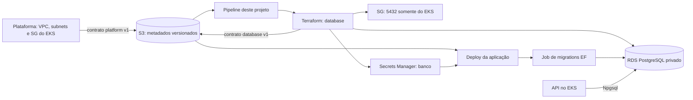
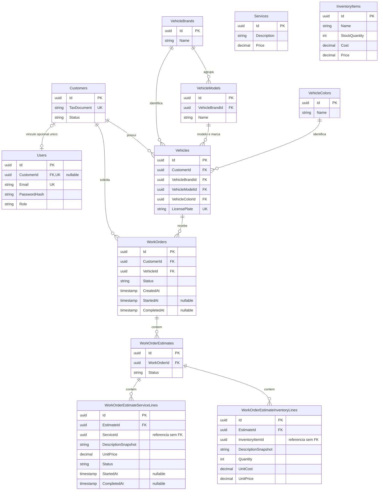
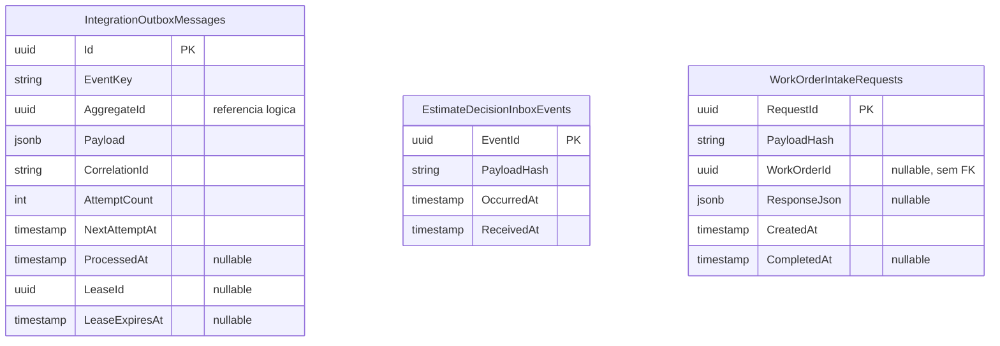

# GarageFlow — Banco de dados gerenciado

Documentação principal da persistência do GarageFlow: infraestrutura RDS, escolha do PostgreSQL, modelo relacional, relacionamentos e operação. Este projeto provisiona a instância, rede de acesso e segredo do banco. As tabelas e migrations são mantidas pela [aplicação](https://github.com/DiegoRugue/GarageFlow#persistência-e-decisões).

## Sumário

- [Arquitetura e responsabilidades](#arquitetura-e-responsabilidades)
- [Escolha do PostgreSQL](#escolha-do-postgresql)
- [Modelo relacional](#modelo-relacional)
- [Consistência e índices](#consistência-e-índices)
- [Configuração do RDS](#configuração-do-rds)
- [Execução e deploy](#execução-e-deploy)
- [Artefatos e referências](#artefatos-e-referências)

## Arquitetura e responsabilidades



A [plataforma](https://github.com/DiegoRugue/garageflow-infra-kubernetes#readme) fornece VPC, duas subnets de banco e security group do cluster. Este root cria subnet group e SG do RDS, aceitando TCP 5432 somente do SG do EKS. As [funções serverless](https://github.com/DiegoRugue/garageflow-serverless#readme) consultam o cliente pela API privada e não acessam o banco diretamente.

Não se lê state de outro root. O state deste projeto fica em `phase3/{environment}/database.tfstate`; os consumidores usam `contracts/v1/{environment}/database.json`, com revisão imutável publicada antes da chave estável. Contratos contêm hostname, porta, nome do banco e ARNs/IDs permitidos, nunca senhas.

## Escolha do PostgreSQL

O domínio reúne relações entre cliente, veículo, OS, versões de orçamento e linhas de serviço/material. PostgreSQL permite manter esse conjunto com transações ACID, FKs, constraints e índices únicos, incluindo unicidade parcial. O EF Core/Npgsql mapeia value objects para colunas e permite evoluir o esquema por migrations versionadas junto dos casos de uso.

| Necessidade | Decisão e consequência |
| --- | --- |
| Integridade da OS e orçamento | Modelo relacional e transações; regras de negócio continuam no domínio |
| Valores monetários | `numeric(18,2)` nas linhas e itens, sem ponto flutuante para preços |
| Histórico do orçamento | Descrição/preço são snapshots nas linhas, preservados após mudanças no catálogo |
| Payload técnico variável | `jsonb` restrito a outbox e resposta idempotente; entidades principais seguem relacionais |
| Consulta diária de OS | Índices em timestamps e agregação no banco; não duplicar eventos para reconstruir totais |
| Operação na nuvem | RDS gerencia instância e backups; aplicação continua responsável por migrations e consultas |

A escolha reaproveita o PostgreSQL das fases anteriores e evita adicionar outro mecanismo de persistência sem necessidade do domínio. Uma base documental exigiria reconstruir garantias relacionais na aplicação; uma instância autogerenciada acrescentaria administração do serviço e backups. O custo desta escolha inclui manutenção de índices, coordenação de migrations e capacidade finita da instância. Single-AZ no laboratório não oferece failover Multi-AZ.

## Modelo relacional

O ER representa as tabelas de negócio e **somente FKs presentes no modelo EF**. Mostra as colunas relevantes para leitura dos relacionamentos, não o dicionário completo. A definição executável está no [snapshot EF](https://github.com/DiegoRugue/GarageFlow/blob/main/Adapters.Infrastructure/DataAccess/Migrations/GarageFlowDbContextModelSnapshot.cs) e nas [migrations](https://github.com/DiegoRugue/GarageFlow/tree/main/Adapters.Infrastructure/DataAccess/Migrations).



Um cliente pode ter vários veículos e OS, e no máximo um usuário vinculado; usuários administrativos podem não ter `CustomerId`. Cada OS referencia um cliente e um veículo obrigatórios. A FK composta de veículo para `(VehicleModelId, VehicleBrandId)` garante que a marca corresponda à do modelo. A compatibilidade entre dono do veículo e cliente da OS é uma regra da aplicação/domínio, não uma FK composta adicional.

Cada OS pode acumular orçamentos; um índice parcial limita a um orçamento `Approved` por OS. Cada orçamento contém linhas de serviço e de materiais. `ServiceId` e `InventoryItemId` são referências lógicas sem FK configurada: as linhas preservam snapshots; o diagrama não atribui ao banco uma garantia inexistente.

As tabelas técnicas abaixo não possuem FKs para as tabelas de negócio:



A outbox controla publicação posterior, retry e lease; não garante entrega exatamente uma vez. A inbox identifica decisões já recebidas por `EventId`. O recibo de intake vincula a chave da requisição ao hash e resultado armazenado para repetição idempotente. Não há acesso direto da Lambda a essas tabelas.

## Consistência e índices

| Mapeamento | Garantia ou finalidade |
| --- | --- |
| `Customers.TaxDocument`, `Users.Email`, `Vehicles.LicensePlate` únicos | Evitar duplicidade dos identificadores normalizados |
| `Users.CustomerId` único quando não nulo | No máximo um usuário de portal por cliente |
| `CK_Customers_Status` | Apenas `Active` ou `Suspended` |
| Modelo `(Id, VehicleBrandId)` e FK composta do veículo | Consistência entre marca e modelo |
| `WorkOrderEstimates.WorkOrderId` único quando `Status = 'Approved'` | Um orçamento aprovado por OS |
| OS por `CustomerId`, `VehicleId`, `CreatedAt`, `CompletedAt` | Consultas de propriedade, veículo e intervalos diários |
| Linhas de serviço por `(ServiceId, CompletedAt)` | Agregação de duração por serviço |
| Outbox por `(NextAttemptAt, OccurredAt, Id)` quando `ProcessedAt IS NULL` | Seleção ordenada das mensagens pendentes |

Exclusões de cadastros referenciados usam `Restrict`. Dentro do agregado, OS → orçamentos → linhas usa `Cascade`. Essas regras de banco não concedem autorização para excluir registros pela API.

Na Fase 3, `AddCustomerStatus` adicionou status com padrão `Active` e constraint de valores, suportando suspensão do portal. `AddWorkOrderCreatedAtIndex` acrescentou índice para os intervalos de criação usados pelos indicadores. Duração reutiliza `StartedAt`/`CompletedAt`, sem criar histórico por status. Os índices têm custo de armazenamento/escrita; o plano de consulta pode usar scan em tabelas pequenas. Ajustes de performance devem ser apoiados por medidas reais.

## Configuração do RDS

| Parâmetro | Configuração |
| --- | --- |
| Região e engine | `us-east-1`, PostgreSQL 17 |
| Capacidade Academy | `db.t3.micro`, 20 GiB GP2 criptografados, Single-AZ |
| Rede | Subnets dedicadas, acesso público desabilitado, porta 5432 restrita ao EKS |
| Backups | Retenção de sete dias |
| Nome | `garageflow-{environment}` |
| Segredo | `garageflow/{environment}/database`; campos `username`, `database`, `password` |
| Preservação | Proteção contra exclusão por padrão e snapshot final retido |

Um teardown do laboratório exige a opção explícita `allow_database_destroy=true`; se o nome de snapshot final já existir, configurar `final_snapshot_identifier` único. Isso é separado do deploy normal. A senha existe no Secrets Manager e no state protegido; não é conteúdo de contrato nem argumento público da aplicação.

## Execução e deploy

Pré-requisitos: Terraform 1.15.7, providers AWS 6.49.0/random 3.9.0, Python e Bash. Os testes usam providers simulados e não exigem AWS.

```bash
python -m pip install --require-hashes --requirement requirements-test.txt
python -m unittest discover -s scripts/tests -v
python -m unittest discover -s tests -v
terraform fmt -check -recursive infra
terraform -chdir=infra/database init -backend=false -input=false
terraform -chdir=infra/database validate
terraform -chdir=infra/database test
bash -n scripts/deploy-database.sh
```

Para desenvolvimento funcional da API, use o [Docker Compose da aplicação](https://github.com/DiegoRugue/GarageFlow#execução-e-documentação-da-api), que inclui PostgreSQL local. Este repositório não precisa de Dockerfile próprio: sua entrega é Terraform.

O [workflow de deploy](.github/workflows/deploy.yml) executa após push em `develop` → `homologation` ou `main` → `production`, depois do quality gate do mesmo commit. Prepare previamente as branches, suas proteções e os GitHub Environments; o workflow não os cria. Configure em cada Environment:

- Secrets: `AWS_ACCESS_KEY_ID`, `AWS_SECRET_ACCESS_KEY`, `AWS_SESSION_TOKEN`, `TF_STATE_BUCKET`.
- Variables: `AWS_ACCOUNT_ID`, `TF_OWNER`, `TF_EXPIRES_ON`.
- Opções de teardown, somente quando necessário: `TF_ALLOW_DATABASE_DESTROY`, `TF_FINAL_SNAPSHOT_IDENTIFIER`.

O deploy valida conta/região, oferta RDS e contrato platform v1; gera tfvars e plano em `RUNNER_TEMP`; aplica o plano salvo, aguarda RDS e publica database v1. A aplicação consome esse contrato e executa migrations antes do rollout. Ordem: **plataforma → banco e ingress → aplicação → serverless → edge**. Credenciais e ambiente Academy duram cerca de quatro horas; renovar a sessão antes da execução. Ausência de contrato ou credenciais válidas interrompe o deploy.

## Artefatos e referências

| Artefato | Finalidade |
| --- | --- |
| [Terraform database](infra/database) | Root e módulo do banco |
| [Exemplo de entradas](infra/database/terraform.tfvars.example) | Parâmetros de referência; manter valores reais fora do Git |
| [Contrato v1](contracts/infra-contract-v1.schema.json) | Metadados publicados/consumidos |
| [Quality gate](.github/workflows/quality-gate.yml) | Validação local e política de repositório |
| [Deploy e execuções](https://github.com/DiegoRugue/garageflow-infra-database/actions) | Histórico de CI/CD |
| [RFC de plataforma e persistência](https://github.com/DiegoRugue/GarageFlow/blob/main/docs/architecture/rfcs/0001-phase-3-platform-and-identity.md) | Fronteiras e ordem dos produtores/consumidores |
| [ADR dos indicadores](https://github.com/DiegoRugue/GarageFlow/blob/main/docs/architecture/adrs/0003-work-order-business-metrics.md) | Agregação diária, índice e semântica de duração |

RDS não expõe Swagger/Postman nem endpoint HTTP público. O consumo funcional é documentado no [OpenAPI/Scalar da aplicação](https://github.com/DiegoRugue/GarageFlow#execução-e-documentação-da-api). O hostname privado é descoberto pelo contrato database; a URL pública da solução é administrada pela plataforma. Não executar o provisionamento monolítico da Fase 2 sobre estes mesmos recursos.
